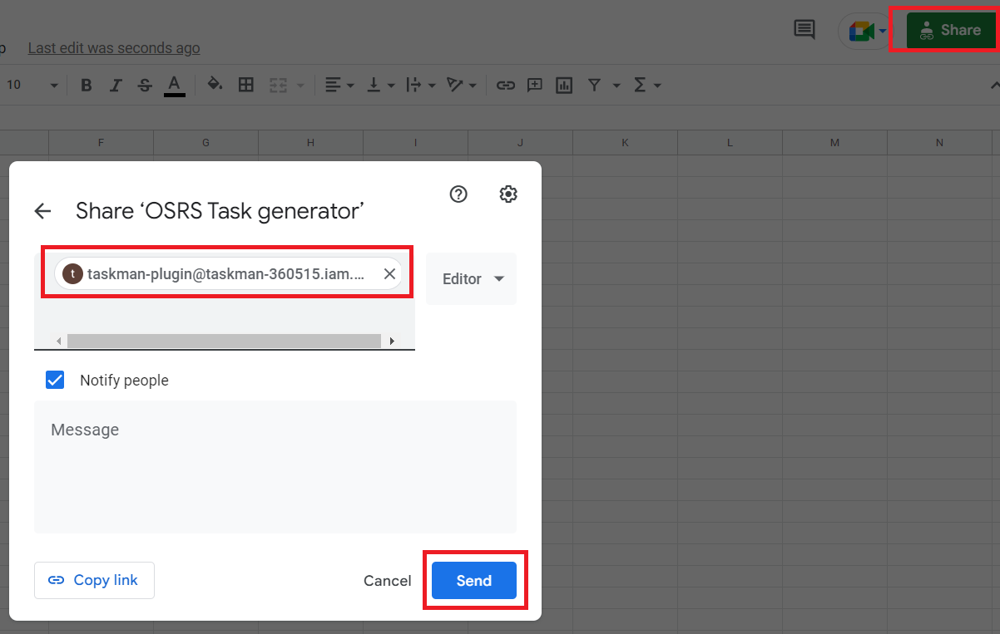
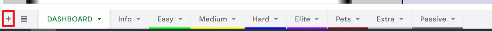
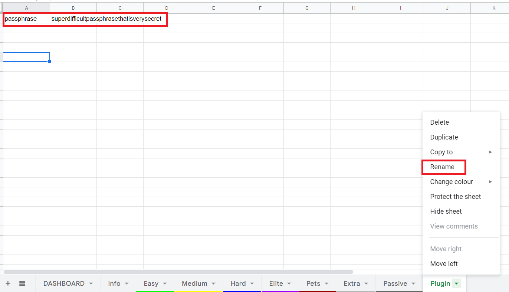
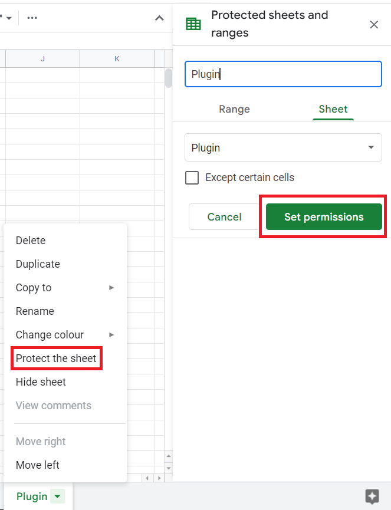
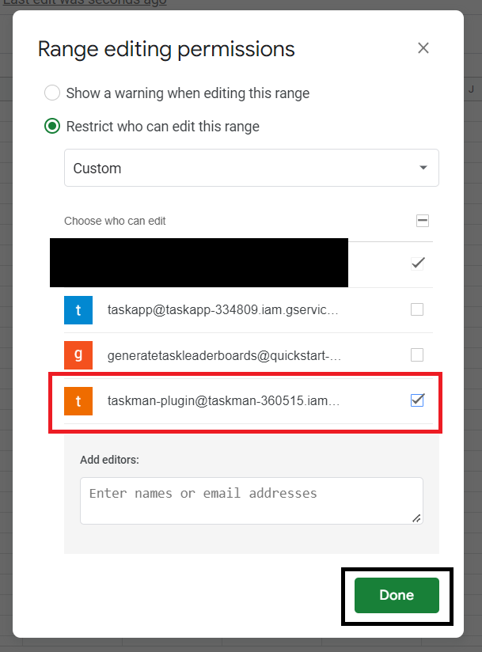
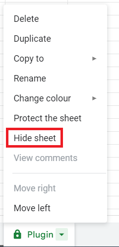
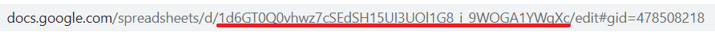
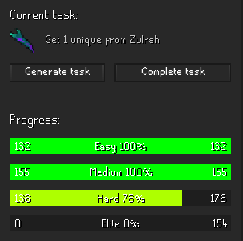

# Taskman

Taskman mode for OSRS.  
[Watch GenerateTask on Youtube!](https://bit.ly/2vgt1Od)  
[Join the Discord!](https://discord.gg/3dZ4dhy)

### How to configure

#### Spreadsheet

Follow these steps to give the plugin access to your spreadsheet. It needs this to read you current progress and to
generate and complete your tasks.

1. Share you spreadsheet with `taskman-plugin@taskman-360515.iam.gserviceaccount.com`  
   
2. Add a new sheet  
   
3. Enter a passphrase and rename the sheet. **Please do not use your Runescape password!**  
   
4. Protect the sheet  
   
5. Set permissions  
   
6. Hide the sheet  
   

Make sure the permissions have been set properly and the sheet is hidden.
If you did not do this properly other people could generate / complete your tasks!

#### Runelite

Follow these steps to configure the Runelite plugin.

1. Search the Plugin hub for `Taskman` and add it to your client
2. Open the `Taskman` configurations
3. Enter your spreadsheet key in the spreadsheet key field. You can find this key in the url of your spreadsheet.
   
4. Enter the passphrase you've entered in your spreadsheet in the passphrase field

### Start Tasking!

